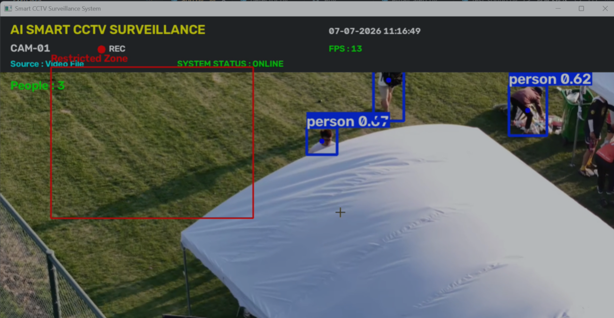
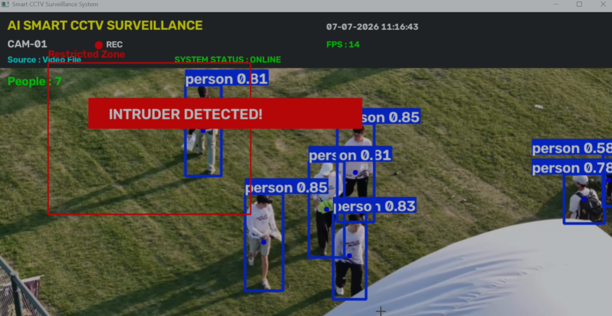

# 🛡️ AI Smart CCTV Surveillance System

> **Real-time AI-powered surveillance using YOLOv8 Nano, OpenCV, and Python**

An intelligent CCTV surveillance system that detects people in real time, monitors a predefined restricted zone, captures evidence upon intrusion, logs events, and sends automated email alerts with the captured image.

This project demonstrates the practical application of **Computer Vision** and **Deep Learning** for automated security monitoring.

---

## 🚀 Features

- 🔍 Real-time **Person Detection** using YOLOv8 Nano
- 🚫 Restricted Zone Monitoring
- 🚨 Automatic Intrusion Detection
- 📸 Automatic Screenshot Capture
- 📧 Email Alerts with Attached Evidence
- 👥 Live People Count
- ⏱️ FPS Counter
- 🕒 Live Timestamp Overlay
- 📹 Multiple Input Sources
  - Live Webcam
  - Video File
  - IP Camera
- 📝 Intrusion Event Logging

---

# 📸 Project Preview

## Live Monitoring

<p align="center">

</p>

---

## Intrusion Detection

<p align="center">

</p>

---

## Email Alert

<p align="center">

</p>

---

# 🏗️ System Architecture

```text
                Camera / Video / IP Camera
                         │
                         ▼
              YOLOv8 Nano Person Detection
                         │
                         ▼
             Restricted Zone Monitoring
                         │
          ┌──────────────┴──────────────┐
          │                             │
     No Intrusion                Intrusion Detected
          │                             │
          ▼                             ▼
 Continue Monitoring          Capture Current Frame
                                        │
                                        ▼
                             Save Intrusion Image
                                        │
                                        ▼
                              Send Email Notification
                                        │
                                        ▼
                                Log Intrusion Event
```

---

# 🛠️ Tech Stack

| Category | Technologies |
|----------|--------------|
| Programming Language | Python |
| Computer Vision | OpenCV |
| Deep Learning | YOLOv8 Nano |
| Framework | Ultralytics |
| Email Alerts | SMTP |
| Image Processing | NumPy |
| Version Control | Git & GitHub |

---

# 📂 Project Structure

```text
Smart-CCTV-System/

├── app.py
├── config.py
├── detector.py
├── email_alert.py
├── utils.py
│
├── captures/
├── screenshots/
├── sounds/
├── videos/
│
├── README.md
├── requirements.txt
└── .gitignore
```

---

# ⚙️ Installation

Clone the repository

```bash
git clone https://github.com/Avanisingh2006/Smart-CCTV-System.git
```

Move into the project

```bash
cd Smart-CCTV-System
```

Install dependencies

```bash
pip install -r requirements.txt
```

Run the application

```bash
python app.py
```

Select the desired input source:

```text
1 → Live Webcam

2 → Video File

3 → IP Camera
```

---

# 🔄 Workflow

1. Capture frames from the selected video source.
2. Detect people using **YOLOv8 Nano**.
3. Monitor the restricted zone.
4. If an intrusion is detected:
   - Display an alert
   - Capture the current frame
   - Save the image
   - Send an email notification
   - Log the event
5. Continue monitoring in real time.

---

# 🎯 Current Capabilities

- ✅ Real-time object detection
- ✅ Restricted zone monitoring
- ✅ Automated email notifications
- ✅ Intrusion evidence capture
- ✅ Event logging
- ✅ Webcam support
- ✅ Video file support
- ✅ IP camera support

---

# 🔮 Future Improvements

- 🌐 Streamlit Web Dashboard
- 🚶 Person Tracking (ByteTrack)
- 🗄️ SQLite Database Integration
- 🤖 Gemini AI Scene Description
- 📹 Automatic Video Recording
- 📊 Analytics Dashboard
- ☁️ Cloud Deployment
- 📱 Mobile Notifications

---

# 📚 Learning Outcomes

This project provided hands-on experience with:

- Computer Vision
- Object Detection using YOLOv8
- OpenCV
- Real-Time Video Processing
- Python Application Development
- Event-Based Automation
- Email Integration
- Git & GitHub

---

# 👩‍💻 Author

## Avani Singh

B.Tech Computer Science Engineering

### Areas of Interest

- Computer Vision
- Artificial Intelligence
- Machine Learning
- Deep Learning
- Intelligent Surveillance Systems

GitHub:
https://github.com/Avanisingh2006

---

## ⭐ If you found this project interesting, consider giving it a Star!
