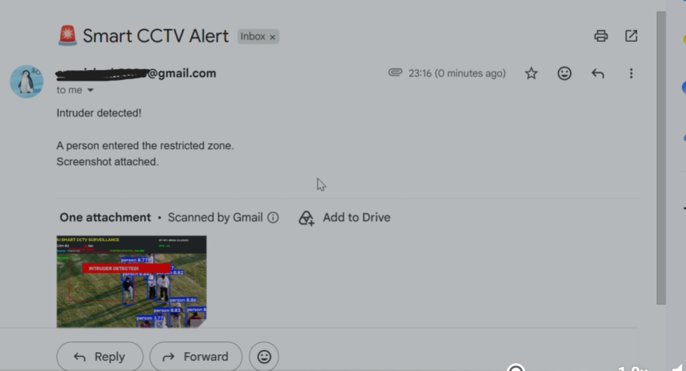

# 🛡️ AI Smart CCTV Surveillance System

An AI-powered CCTV surveillance system built using **Python**, **OpenCV**, and **YOLOv8 Nano** for real-time person detection, restricted-zone monitoring, and automated intrusion alerts.

The system detects people entering a predefined restricted area, captures evidence, logs the event, and automatically sends an email alert with the captured image. It supports multiple input sources, including live webcams, prerecorded videos, and IP cameras.

---

## 📽️ Demo

> 🎥 Demo video available on my LinkedIn project post.

---

# ✨ Features

- 🔍 Real-time person detection using **YOLOv8 Nano**
- 🚫 Restricted Zone Monitoring
- 🚨 Automatic Intrusion Detection
- 📸 Automatic Screenshot Capture
- 📧 Email Alert with Attached Evidence
- 📊 Live People Count
- ⏱️ Real-Time FPS Display
- 🕒 Live Timestamp Overlay
- 📹 Supports Multiple Video Sources
  - Webcam
  - Video Files
  - IP Camera Streams
- 📝 Intrusion Logging

---

# 📸 Screenshots

## Live Monitoring


---

## Intrusion Detection


---

## Email Alert

> *(Blur your email address before uploading this screenshot.)*



---

# 🏗️ System Workflow

```text
                 Camera / Video / IP Camera
                          │
                          ▼
                YOLOv8 Nano Person Detection
                          │
                          ▼
               Restricted Zone Monitoring
                          │
              ┌───────────┴───────────┐
              │                       │
         No Intrusion          Intrusion Detected
              │                       │
              ▼                       ▼
      Continue Monitoring     Capture Screenshot
                                       │
                                       ▼
                              Save Intrusion Image
                                       │
                                       ▼
                               Send Email Alert
                                       │
                                       ▼
                                Log Detection
```

---

# 🛠️ Tech Stack

| Category | Technologies |
|----------|--------------|
| Programming Language | Python |
| Computer Vision | OpenCV |
| Object Detection | YOLOv8 Nano |
| Deep Learning | Ultralytics YOLO |
| Email Notifications | SMTP |
| Image Processing | NumPy |
| Version Control | Git & GitHub |

---

# 📂 Project Structure

```text
Smart-CCTV-System/

├── app.py
├── config.py
├── detector.py
├── email_alert.py
├── utils.py
│
├── captures/
├── sounds/
├── videos/
├── screenshots/
│
├── README.md
├── requirements.txt
└── .gitignore
```

---

# ⚙️ Installation

Clone the repository

```bash
git clone https://github.com/Avanisingh2006/Smart-CCTV-System.git
```

Move into the project directory

```bash
cd Smart-CCTV-System
```

Install dependencies

```bash
pip install -r requirements.txt
```

Run the project

```bash
python app.py
```

Choose the input source:

```text
1 → Live Webcam
2 → Video File
3 → IP Camera
```

---

# 🚀 How It Works

1. Capture frames from the selected video source.
2. Detect people using **YOLOv8 Nano**.
3. Check whether any detected person enters the restricted zone.
4. If an intrusion is detected:
   - Display an intrusion alert.
   - Capture the current frame.
   - Save the image locally.
   - Send an email notification with the captured image.
   - Record the event in the intrusion log.
5. Continue monitoring in real time.

---

# 📈 Current Capabilities

- ✅ Real-time object detection
- ✅ Multi-source video support
- ✅ Intrusion detection
- ✅ Email notifications
- ✅ Automatic evidence capture
- ✅ Event logging
- ✅ Real-time surveillance overlay

---

# 🔮 Future Improvements

- 🌐 Streamlit Web Dashboard
- 🚶 Person Tracking (ByteTrack)
- 🗄️ SQLite Database Integration
- 🤖 Gemini AI Scene Description
- 📹 Automatic Video Recording During Intrusions
- 📊 Analytics Dashboard
- 📱 Mobile Notifications
- ☁️ Cloud Deployment

---

# 💡 Learning Outcomes

This project helped me gain practical experience in:

- Computer Vision
- Object Detection with YOLOv8
- OpenCV Image Processing
- Real-Time Video Processing
- Python Application Development
- Event-Based Automation
- Email Integration
- Git & GitHub Workflow

--

# 👩‍💻 Author

**Avani Singh**

B.Tech Computer Science Engineering Student

**Interests**

- Computer Vision
- Artificial Intelligence
- Machine Learning
- Deep Learning
- Intelligent Surveillance Systems

GitHub:
https://github.com/Avanisingh2006

---

# ⭐ Support

If you found this project useful, consider giving it a ⭐ on GitHub.
